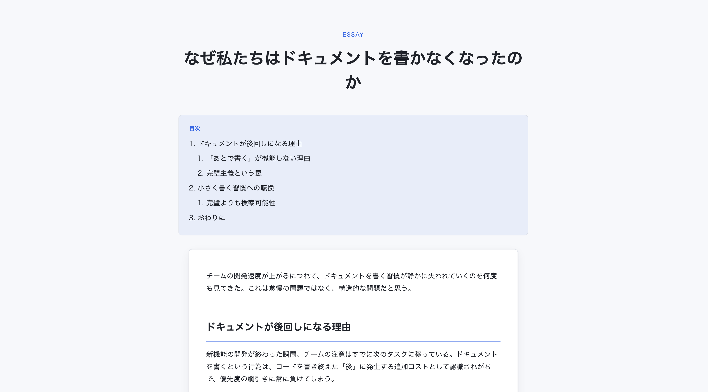
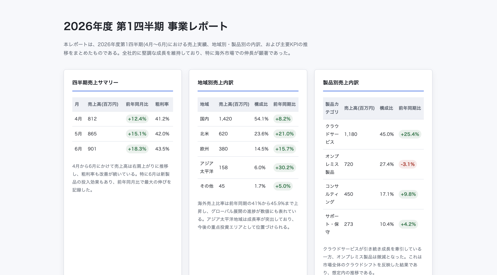
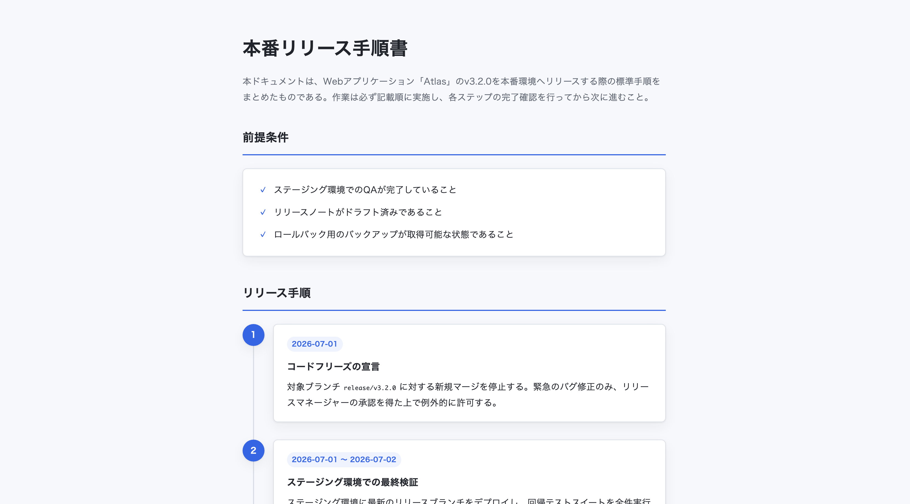
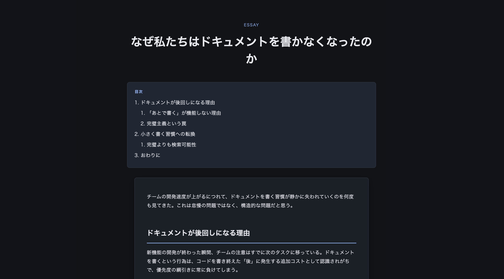
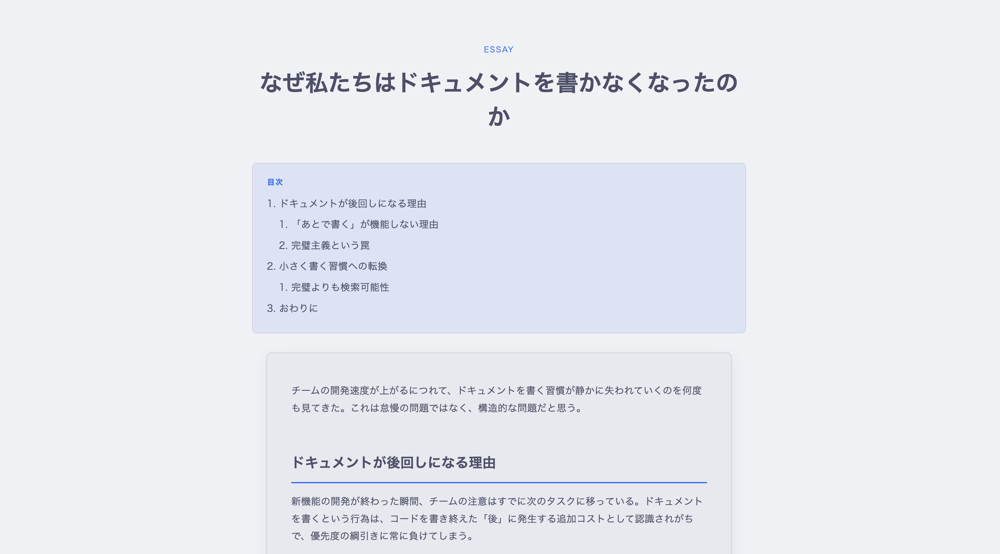
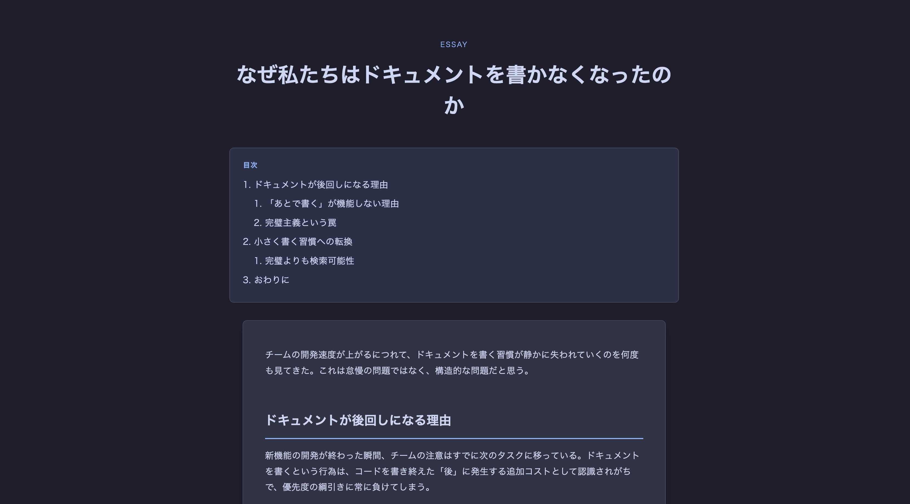
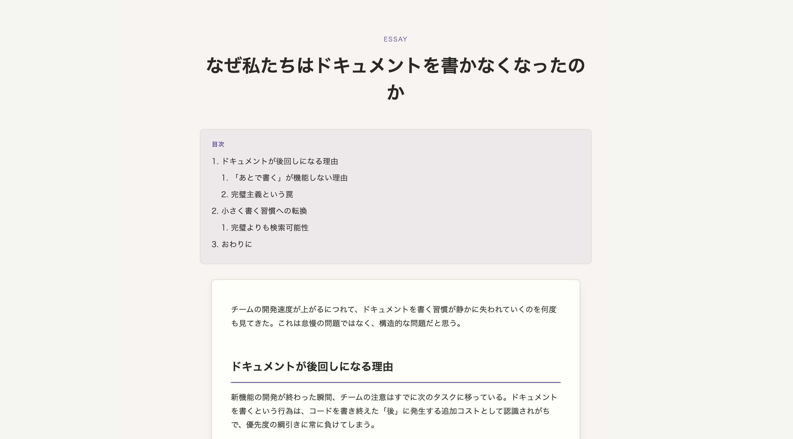
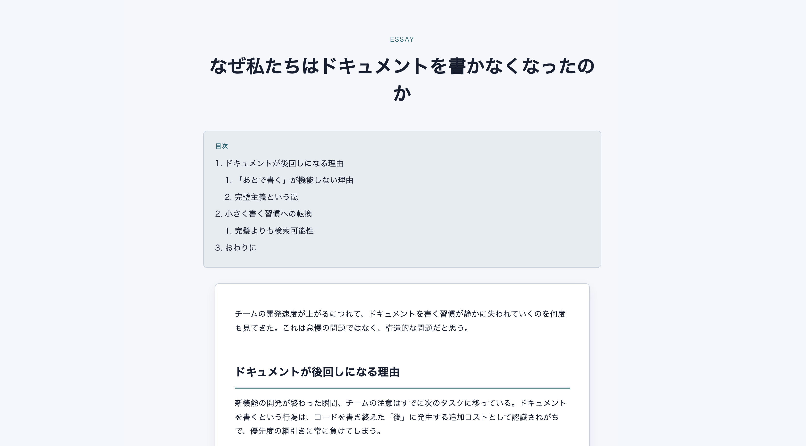
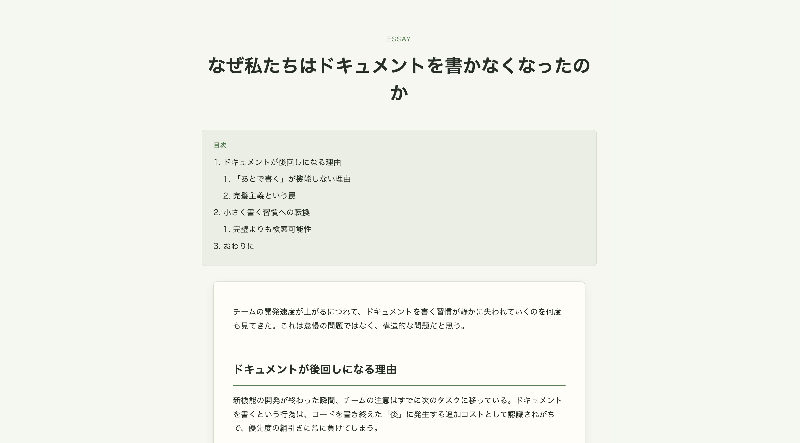
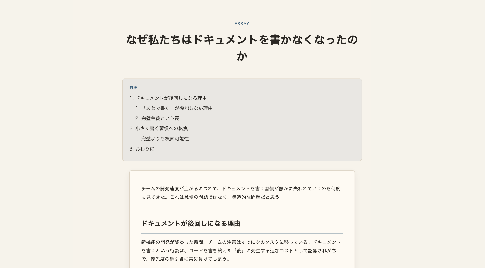

# md-to-html

Markdownファイルの内容を読み取り、表・時系列・比較・階層・コード中心といった文書の性質に合わせてレイアウトを選び、単一の自己完結HTMLとして出力するClaude Code / Codex / Antigravity向けプラグインです。

## 概要

`md-to-html` は、固定テンプレートにMarkdownを流し込むだけの変換ツールではありません。対象ファイルの構造をLLMが読み取り、内容に合った情報設計・視覚表現をその場で組み立てます。

この発想はAnthropicのブログ記事 [The unreasonable effectiveness of HTML](https://claude.com/blog/using-claude-code-the-unreasonable-effectiveness-of-html) に由来しています。静的なコンバータでは表現しづらい、文書ごとに最適化された読みやすいHTMLを作ることを狙っています。

主な特徴:

- Markdown本文を欠落・要約せず、単一HTMLに変換
- CSSと軽量なvanilla JSをインライン化し、外部ネットワーク依存を持たない
- light / dark、Catppuccin Latte / Mocha、editorial / technical、natural / wa のテーマCSSを同梱
- レイアウト判定の根拠を生成HTMLのコメントと完了報告に残す
- 日本語Markdownを前提にした行間・フォントスタック・説明文に対応

## サンプル出力

### Lightテーマ


Markdown: evals/samples/article.md


Markdown: evals/samples/table-heavy.md


Markdown: evals/samples/timeline.md

### Darkテーマ


Markdown: evals/samples/article.md

### Catppuccin Latteテーマ


Markdown: evals/samples/article.md

### Catppuccin Mochaテーマ


Markdown: evals/samples/article.md

### Editorialテーマ


Markdown: evals/samples/article.md

### Technicalテーマ


Markdown: evals/samples/article.md

### Naturalテーマ


Markdown: evals/samples/article.md

### Waテーマ（和）


Markdown: evals/samples/article.md

## インストール

### Claude Code

Claude Codeでは、このリポジトリをマーケットプレイスとして追加してからインストールします。

```
/plugin marketplace add sysCat64/md-to-html
/plugin install md-to-html
```

### Codex

Codex CLIでは、このリポジトリをCodex plugin marketplaceとして追加してからプラグインをインストールします。

GitHubからインストールする場合:

```bash
codex plugin marketplace add sysCat64/md-to-html --ref main
codex plugin add md-to-html@md-to-html
```

ローカルで試す場合:

```bash
git clone https://github.com/sysCat64/md-to-html.git
cd md-to-html
codex plugin marketplace add "$PWD"
codex plugin add md-to-html@md-to-html
```

更新後にCodexへ再読み込みさせたい場合は、同じ `codex plugin add md-to-html@md-to-html` を再実行し、新しいCodexスレッドを開始してください。

Codexは `.agents/plugins/marketplace.json` をマーケットプレイス定義として読み込み、プラグイン本体ではリポジトリ直下の `.codex-plugin/plugin.json` を使用します。

### Antigravity

Antigravity CLI (`agy`) では、このリポジトリを指定、あるいはローカルパスを指定してプラグインをインストールします。

GitHubからインストールする場合:

```bash
agy plugin install https://github.com/sysCat64/md-to-html.git#main:.antigravity-plugin
```

ローカルで試す場合:

```bash
git clone https://github.com/sysCat64/md-to-html.git
cd md-to-html
agy plugin install .antigravity-plugin
```

インストールの確認やロードされたスキルの確認は、`agy` CLI 内で `/skills` を実行するか、`agy inspect` コマンドで確認できます。

各環境のマニフェストは分離していますが、実際のスキル本体と判定ロジックは共通です。

## 使い方

```
/md-to-html path/to/file.md
/md-to-html path/to/file.md --theme dark
/md-to-html path/to/file.md --theme catppuccin-latte
/md-to-html path/to/file.md --theme catppuccin-mocha
/md-to-html path/to/file.md --theme editorial
/md-to-html path/to/file.md --theme technical
/md-to-html path/to/file.md --theme natural
/md-to-html path/to/file.md --theme wa
```

スラッシュコマンドを使わず、会話の中で「このmdをHTMLにして」「Markdownをきれいなページにして」のように依頼しても自動的に発火します。

出力先は、入力Markdownと同じディレクトリの `<入力ファイル名>.html` です。たとえば `report.md` は `report.html` に変換されます。

## レイアウト判定の概要

Markdownの特徴量(テーブル数・コード比率・見出し階層・時系列シグナル・比較シグナルなど)を抽出し、以下の優先順位カスケードで6種類のレイアウトから1つを選定します。上の行ほど優先度が高く、複数条件に当てはまる場合は上位の意味構造を優先します。

| レイアウト | 主な発火条件 |
|---|---|
| 2〜3カラムのカード比較 | 比較シグナルがあり、比較対象が2〜3個に明確化できる |
| タイムライン/ステッパー | Step・連番などの時系列シグナルが文書の骨格(5個以上連続) |
| コードカード | コード面積30%以上、またはコードブロック5個以上 |
| ダッシュボード風グリッド/テーブルカード | テーブル3個以上、またはテーブル面積40%以上 |
| サイドバーナビ+アコーディオン(またはタブ) | 最大階層h3以上 かつ 見出し8個以上 |
| シンプル縦スクロール記事 | 上記いずれも非該当 |

判定がどの条件にも強く当てはまらない場合は、シンプル記事を基調に、該当箇所だけ局所的に強調するハイブリッド構成にフォールバックします。判定ロジックの詳細な手順(特徴量の数え方、優先順位の理由)は [`skills/md-to-html/SKILL.md`](skills/md-to-html/SKILL.md) のSYNC-BLOCKに記載しています。

## テーマのカスタマイズ

生成されるHTMLは、`skills/md-to-html/templates/` 配下の `theme-*.css` の `:root` ブロックをそのままインライン展開して使用します。標準の `light` / `dark` に加えて、[Catppuccin](https://catppuccin.com/palette/) の `catppuccin-latte` / `catppuccin-mocha`、長文記事向けの `editorial`、README・spec・表・コード向けの `technical`、穏やかな自然色の `natural`、和紙と藍を意識した `wa` も選択できます。すべてのテーマは以下のCSS変数を同名・同数で定義するというコントラクトを守っており、生成HTML側は色・フォント・余白の値をこの変数経由でのみ参照します。

- `--bg`, `--surface`, `--text`, `--text-muted`, `--border`, `--accent`, `--accent-contrast`, `--code-bg`
- `--font-sans`, `--font-mono`, `--line-height`, `--letter-spacing`
- `--space-unit`, `--radius`, `--content-max-width`

配色や余白を変更したい場合は、これらのCSSファイルの値を編集するだけで、生成されるすべてのHTMLに反映されます。`--theme latte` は `catppuccin-latte`、`--theme mocha` は `catppuccin-mocha` の短縮名として扱います。

## ディレクトリ構成

```
.agents/plugins/marketplace.json        Codex marketplace定義
.claude-plugin/marketplace.json         Claude Code marketplace定義
.claude-plugin/plugin.json              Claude Code用プラグインマニフェスト
.codex-plugin/plugin.json               Codex用プラグインマニフェスト
.antigravity-plugin/plugin.json         Antigravity用プラグインマニフェスト
.antigravity-plugin/skills/md-to-html   Antigravity用のskillsシンボリックリンク
.agent/skills/md-to-html/INSTRUCTIONS.md  ツール非依存の判定ロジック正本
skills/md-to-html/SKILL.md              スキル定義(判定ロジック含む)
skills/md-to-html/templates/            テーマCSS(light / dark / Catppuccin / editorial / technical / natural / wa)
evals/evals.json                        評価ケース定義
evals/samples/                          評価用サンプルMarkdown
```

## マルチエージェント対応

判定ロジックの正本は [`.agent/skills/md-to-html/INSTRUCTIONS.md`](.agent/skills/md-to-html/INSTRUCTIONS.md) にあり、`SKILL.md` はこのファイルとSYNC-BLOCK部分を完全一致させる運用としています。

Claude Code用、Codex用、Antigravity用のマニフェストは分離しつつ、スキル本体は同じ正本から同期します。環境ごとの配布形態を変えても、レイアウト判定の挙動がずれないようにするためです。

## ライセンス

MIT
